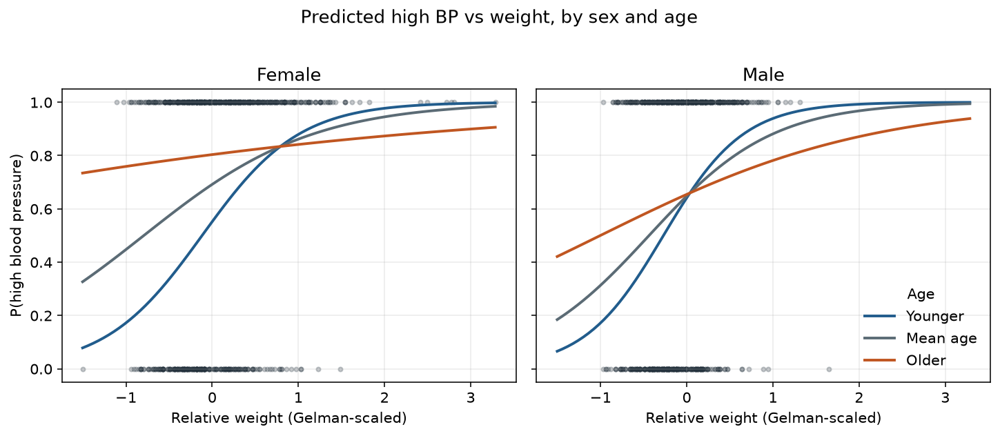

# Framingham subset: blood pressure and CHD

A **1,394-person teaching extract** of the Framingham Heart Study. Three nested questions, a small Python pipeline, and metrics that are allowed to be modest.

This is a cross-sectional table plus a follow-up CHD code. It is not the Framingham risk score, and it is not a model for clinic use.

[](docs/figures/hbp_weight_sex_age.png)

## What I asked

1. How much of **systolic BP** at the exam lines up with relative weight, sex, cholesterol, and age?
2. Do those same background variables distinguish people who meet the **140/90 mmHg** cut-off?
3. Among people **without CHD at the exam**, do cholesterol, smoking, weight, age, and sex distinguish a later CHD record?

## Sample

| | |
|---|---|
| People | 1,394 adults (731 women, 663 men), ages 45–62 |
| High BP | SBP ≥ 140 or DBP ≥ 90 — **65%** |
| Already had CHD at the exam | `YRS_CHD = pre` — **42** people, dropped from the CHD models |
| Later CHD record | **20%** of the remaining 1,352 |
| Scaling | `(x − mean) / (2 × sd)` so a coefficient is roughly a 2-SD shift |

## Findings

**Systolic BP (linear).** Weight, sex and cholesterol give **R² = 0.125**. Age lifts that to **0.146** and is the only nested step that improves AIC. A full set of two-way interactions, then smoking, barely moves adjusted R² and AIC gets worse. Weight is the largest term; older women sit higher on the SBP–weight line. Residuals are heteroscedastic, so the usual OLS standard errors are optimistic.

**High blood pressure (logistic).** On 100 stratified 80/20 repeats, with scaling refit on each training fold, ROC AUC is **0.66**. Accuracy is **66.7%** against a **64.9%** majority baseline (always predict high BP). There is a weak but real signal: predicted risk rises with weight, and older people start higher. The usual 0.5 cut-off labels **86%** of people as high BP, so accuracy is the wrong headline.

**Incident CHD (logistic).** The headline model is cholesterol, smoking, relative weight, **age, and sex** — no pairwise products. Age and sex earn their place: AIC falls from **1,328** (cholesterol, smoking, and weight only) to **1,281**, and in-sample AUC rises from **0.59** to **0.66**. Adding the interactions back does not help. On the same 100 hold-outs, ROC AUC is **0.65**. Accuracy at 0.5 is **80.4%**, which is the majority class (always predict no event). At that cut-off the model almost never predicts CHD.

Sex is the largest coefficient in the CHD fit; age is next. Smoking shrinks once sex is in the model (men smoke more in this table) and is only borderline (`p = 0.056`).

A person with cholesterol 200, 17 cigarettes a day, relative weight 100, and sample-mean age has predicted P(later CHD record) **12%** if a woman and **23%** if a man.

## What this is not

- A 10-year risk engine. Follow-up time is not modelled; people with a later CHD code are treated as a binary event.
- Proof that the 0.5 accuracy of a rare-event logit is “good enough to use.” It is not.

## How to run

```bash
git clone https://github.com/ThacienneUwimanayantumye/framingham-blood-pressure-and-chd.git
cd framingham-blood-pressure-and-chd
python3 -m venv .venv
source .venv/bin/activate
pip install -r requirements.txt
pytest
python scripts/run_analysis.py
```

Tables land in `data/derived/`. Figures land in `docs/figures/`.

## Layout

| Path | Role |
|---|---|
| `data/raw/fram.txt` | Framingham teaching extract |
| `src/framreg/` | Load, outcomes, scale, fit, evaluate, plot |
| `scripts/run_analysis.py` | One-command reproduce |
| `docs/figures/` | SBP, high BP, and incident-CHD plots |

## License

MIT. Framingham data remain a teaching subset of the original study.
